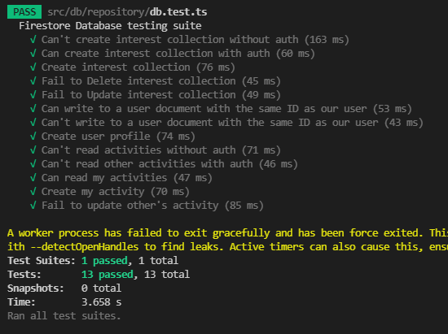

# Boon Companion

## Working Prototype and Code
Prototype URL: https://boon-companion.web.app/

Code URl: https://github.com/deepbig/boon-companion/tree/main

## Project Documents
Documents URL: https://github.com/deepbig/boon-companion/tree/main/documents

## Team: 4
### Team Members:             
Mani Kumar Gouni 
Deepthi Pottipally 
Sai Krupa Bariki Vidura 
Aparna Sykam 
Hongsuk Ryu 

# Sprint 1
## Story Point: Forecast and Rationale 
### The forecast for the first sprint includes: 41

### Rationale

## Kanban Board: Product Backlog
#### [Kanban Board in Trello](https://trello.com/b/y7M64Ako/kanban-template)

## Sprint Board
#### [Sprint1 Board in Trello](https://trello.com/b/YJLYbSik/sprint-1-programing-project)

## Burndown Chart

## Daily Scrums

## Tests
13 test cases: https://github.com/deepbig/boon-companion/blob/main/src/db/repository/db.test.ts

## Mob Programming Video

## Sprint Review Video

