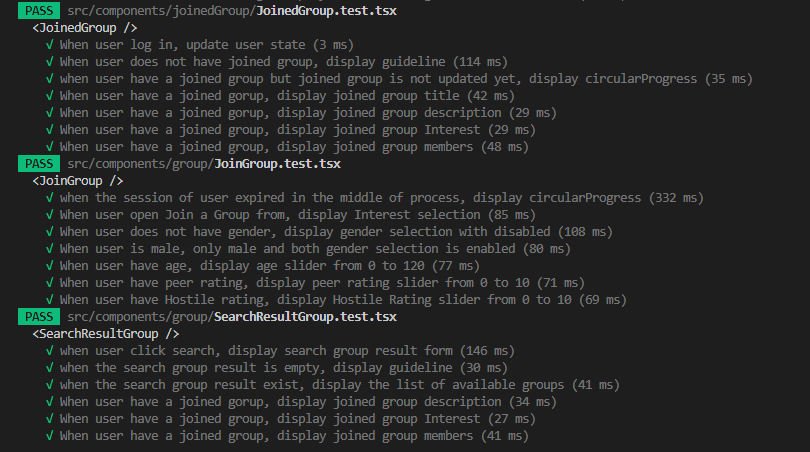
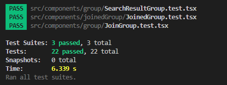

# Boon Companion

## Working Prototype and Code

Prototype URL: https://boon-companion.web.app/

Code URl: https://github.com/deepbig/boon-companion/tree/main

## Project Documents

Documents URL: https://github.com/deepbig/boon-companion/tree/main/documents

## Team: 4

### Team Members:

Mani Kumar Gouni 
Deepthi Pottipally 
Sai Krupa Bariki Vidura 
Aparna Sykam 
Hongsuk Ryu 

# Sprint 2

## Story Point: Forecast and Rationale

### The forecast for the sprint 2 includes:

Total Forecasted : 36

Total Points Completed : 26

Moved to next sprint : 10

### Rationale
**Story:** To update the hostile rating to the user's db. 
**Rationale:** In this story, we implemented a small hostile algorithm to detect unfriendly or aggressive words whenever a user uses them. In the application, the user's hostile rating will be incremented under the hostileRating column in the database. To indicate that the higher the rating, the more unfriendly or aggressive the user is. 
**Story:** Create Group Enhancements (Range Sliders, Logged-in User's Data) 
**Rationale:** By implementing this story, a user can create a group by utilizing the following parameters: list of activities, age, gender, peer rating, hostile rating, and level of experience. Along with these parameters to filter to find the most appropriate matches, the user is allowed to give their own name and title to the group created. 
**Story:** As a user, I want to delete accounts and activities. 
**Rationale:** By implementing this story, users can delete their profiles when they are no longer interested in the application or for any other reason. When a user clicks on the "Delete Account" button, the complete user information will be deleted, including activities. 
**Story:** Allow the user to edit or add to their profile including their list of interests/activities. 
**Rationale:** By implementing this story, users can be allowed to update or add new activities to their user profile data. This makes the application gather more recent information, helps form groups and keeps connecting users. 
**Story:** Allow users to join a group using the searching and filtering group feature. 
**Rationale:** By implementing this story, users can join a group by utilizing the following parameters: list of activities, age, gender, peer rating, hostile rating, and level of experience. These parameters allow the user to filter and find the most appropriate group match. 

In this sprint, we completely focused on allowing users to update and delete user profiles. Along with these, we concentrated on executing some key functionalities like allowing users to create groups using certain criteria and allowing users to join groups based on selected criteria.
 

#### Completed tasks: 

To update the hostile rating to the user's db.

Create Group Enhancements.

As a user, I want to delete accounts and activities.

Allow the user to edit or add to their profile including their list of interests/activities.

Allow users to join a group using the searching and filtering group feature.

#### Moved Tasks:

Build a group dashboard to display current group members and group activities.

As a user, I want to rate my peer user.

## Kanban Board: Product Backlog

#### [Kanban Board in Trello](https://trello.com/b/y7M64Ako/kanban-template)

## Sprint Board

#### [Sprint2 Board in Trello](https://trello.com/b/2cmtpM1p/sprint-2-programming-project)

## Burndown Chart

## Daily Scrums

https://kennesawedu-my.sharepoint.com/:x:/g/personal/mgouni_students_kennesaw_edu/EWdagea_pfVDhuGbD7pEmucBKBc0l73t9oKTBF_o-9PirQ?e=bO7aPq

## Tests
3 test suites with total 22 tests: 
- JoinedGroup (8 unit tests: https://github.com/deepbig/boon-companion/blob/main/src/components/joinedGroup/JoinedGroup.test.tsx)
- JoinGroup (8 unit tests: https://github.com/deepbig/boon-companion/blob/main/src/components/group/JoinGroup.test.tsx)
- SearchResultGroup (6 unit tests: https://github.com/deepbig/boon-companion/blob/main/src/components/group/SearchResultGroup.test.tsx)

 
 

## Mob Programming Video

https://user-images.githubusercontent.com/99055144/161397810-d33cd029-d424-46bb-a833-c9ca318ab979.mp4

## Sprint Review Video

https://user-images.githubusercontent.com/99055144/161397679-70d6bdfd-a82a-4dd1-a996-f546bbe7a777.mp4

## Continuous Integration & Continous Deployment
Team developed CI and CD using Github Actions. When user create pull request, the system run a workflow that run all test cases and create temporary demo page when all tests are passes. Team members can test the new features in the demo page and review the code accordingly. The following link shows the CI script:
https://github.com/deepbig/boon-companion/blob/main/.github/workflows/firebase-hosting-pull-request.yml

Evidence:

Also, when a team member merges his/her code to the main branch, the system will test all changes and deploy to the hosting server automatically. The following link shows the CD script:
https://github.com/deepbig/boon-companion/blob/main/.github/workflows/firebase-hosting-merge.yml

Evidence:

