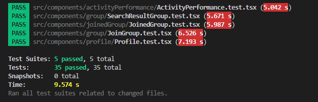

# Boon Companion

## Working Prototype and Code

Prototype URL: https://boon-companion.web.app/

Code URl: https://github.com/deepbig/boon-companion/tree/main

## Project Documents

Documents URL: https://github.com/deepbig/boon-companion/tree/main/documents

## Team: 4

### Team Members:

Mani Kumar Gouni 
Deepthi Pottipally 
Sai Krupa Bariki Vidura 
Aparna Sykam 
Hongsuk Ryu 

# Sprint 3

## Story Point: Forecast and Rationale

### The forecast for the sprint 3 includes:

Total Forecasted : 27

Total Points Completed : 27

### Rationale

**Story:** Verify everywhere user enters a bad in the app. 
**Rationale:** This story is a part of hostile rating, where we count aggressive or unfriendly words and store them in a database to calculate the count of words and display them on the UI under the user profile. 
**Story:** Display the tips in reverse chronological order and also display user name for each tip in the group dashboard. 
**Rationale:** This story is to make the UI more user-friendly by allowing users to see some comments, tips, or suggestions with respective usernames when any user posts them in a group. 
**Story:** Create query to fetch the data based on mentioned conditions. 
**Rationale:** This story is part of finding users by applying filters or criteria to form groups. 
**Story:** Debug on Peer Rating, Hostile Rating, Join & Create Group, Shared Tip, Account Deletion features. 
**Rationale:** This story involves some patchwork or slight changes in code to make the application features more effective and robust. 
**Story:** Write select query to fetch list of profiles with similar activity/interest. 
**Rationale:** This story is part of displaying user activities like by applying some conditions and fetching matched users' activities or interests. The query is written using firestore database rules. 
**Story:** Display and update the activity performance section when a user adds an activity. 
**Rationale:** This story is part of the user edit/update feature, in which the user can add his/her activities to the activity card on the UI, which will then be updated. 
**Story:** Display tips shared by the group members in group dashboard. 
**Rationale:** This story is part of creating group functionality, where users in the group share some comments, tips, suggestions, or even their experience regarding any activity they have performed recently. 
**Story:** Integration Testing. 
**Rationale:** We as team tested the application end to end by creating 4 to 5 accounts/users. 
**Story:** Create component for rating save into db using service. Fetch rates respective to each user to display on board. 
**Rationale:** This story is part of the peer rating of group members. A user is allowed to rate his or her groupmates on a scale of 1 to 10. The logic of peer rating always takes the total average of the given rating and displays it under the respective user profiles. 
**Story:** Unit Testing. 
**Rationale:** Implemented react test cases by using react test-library. 

We plan to deliver a full-fledged real-time application as described in our proposal meeting during this final sprint. 

 
#### Completed tasks: 

Create a component and service to make a rest call with given request

Verify Everywhere user enters a bad in the app.

Display the tips in reverse chronological order and also display user name for each tip in the group dashboard

Create query to fetch the data based on mentioned conditions.

Create component for rating save into db using service. Fetch rates respective to each user to display on board

Write select query to fetch list of profiles with similar activity/interest

Display and update the activity performance section when a user adds an activity.

Display tips shared by the group members in group dashboard.

Create a form to add a tip in the group dashboard.

Unit Testing

Integrationn Testing

## Kanban Board: Product Backlog

#### [Kanban Board in Trello](https://trello.com/b/y7M64Ako/kanban-template)

## Sprint Board

#### [Sprint3 Board in Trello](https://trello.com/b/x1RlD6q8/sprint-3-programming-project)

## Burndown Chart

## Daily Scrums

[Sprint 3- Web Service Engineering Daily Scrum(1-38).xlsx](https://github.com/deepbig/boon-companion/files/8549777/Sprint.3-.Web.Service.Engineering.Daily.Scrum.1-38.xlsx)

## Tests
5 test suites with total 35 tests:
- **[NEW]** ActivityPerformance (4 unit tests: https://github.com/deepbig/boon-companion/blob/main/src/components/activityPerformance/ActivityPerformance.test.tsx)
- **[NEW]** Profile (9 unit tests: https://github.com/deepbig/boon-companion/blob/main/src/components/profile/Profile.test.tsx)
- JoinedGroup (8 unit tests: https://github.com/deepbig/boon-companion/blob/main/src/components/joinedGroup/JoinedGroup.test.tsx)
- JoinGroup (8 unit tests: https://github.com/deepbig/boon-companion/blob/main/src/components/group/JoinGroup.test.tsx)
- SearchResultGroup (6 unit tests: https://github.com/deepbig/boon-companion/blob/main/src/components/group/SearchResultGroup.test.tsx)

 

## Mob Programming Video

https://user-images.githubusercontent.com/99055144/164845134-1df73e96-f66e-4f42-ba5b-11dab5b3f1eb.mp4

## Sprint Review Video

https://user-images.githubusercontent.com/99055144/164845137-0e56f2c3-4509-4b8d-9ca9-5078ab848add.mp4

## Continuous Integration & Continous Deployment
Team developed CI and CD using Github Actions. When user create pull request, the system run a workflow that run all test cases and create temporary demo page when all tests are passes. Team members can test the new features in the demo page and review the code accordingly. The following link shows the CI script:
https://github.com/deepbig/boon-companion/blob/main/.github/workflows/firebase-hosting-pull-request.yml

Evidence:
You can find all evidences in here: https://github.com/deepbig/boon-companion/actions

 

Also, when a team member merges his/her code to the main branch, the system will test all changes and deploy to the hosting server automatically. The following link shows the CD script:
https://github.com/deepbig/boon-companion/blob/main/.github/workflows/firebase-hosting-merge.yml

Evidence:
You can find all evidences in here: https://github.com/deepbig/boon-companion/actions

 
